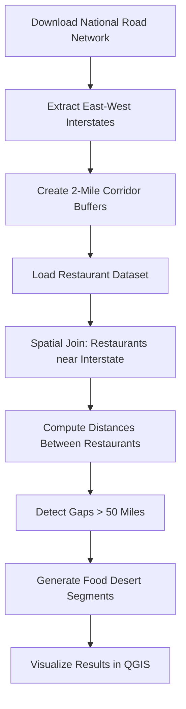

# Interstate Food Accessibility Analysis (United States)


A national-scale geospatial analysis project that identifies **long stretches of U.S. interstate highways where drivers may travel large distances without access to nearby restaurants**.

This project analyzes restaurant accessibility along **major east–west interstate corridors** using **Python, GeoPandas, and QGIS**.

The analysis identifies **“interstate food deserts”** — highway segments where drivers must travel **more than 50 miles between restaurants located within 2 miles of the interstate corridor.**

---

# Project Motivation

Long-distance drivers rely on highway exits for food, fuel, and services.  
In many rural regions of the United States — particularly in the **West and Great Plains** — services can be extremely sparse.

This project explores:

- How accessible restaurants are along interstate corridors
- Where **service deserts** occur
- Which highways contain the **largest accessibility gaps**

The project demonstrates how **Python-based GIS pipelines can scale to national datasets with hundreds of thousands of spatial features.**

---

# Example Result

Some western interstates contain **extremely long gaps between accessible restaurants**.

| Interstate | Longest Gap |
|------------|-------------|
| I-70 | 193 miles |
| I-90 | 165 miles |
| I-40 | 152 miles |
| I-80 | 128 miles |
| I-10 | 117 miles |

These occur mainly across:

- Utah
- Nevada
- Wyoming
- Montana
- Arizona

---
## Example Map

The map below highlights segments of interstate corridors where drivers may encounter long distances between accessible restaurants.

Red segments represent **food deserts (> 50 miles between restaurants).**


---

# Project Workflow



---

# Technologies Used

### Programming

- Python
- GeoPandas
- Pandas
- Shapely
- PyProj
- Rtree

### GIS Software

- QGIS

### Data Sources

- US Census **TIGER/Line Primary Roads**
- **OpenStreetMap** Restaurant Points
- **OpenStreetMap** Interstate Exit Data

---

# Repository Structure

```
interstate_food_accessibility_gis/

data/
│
├── tl_2023_us_primaryroads/
├── restaurants.geojson
├── interstate_exits.geojson

scripts/
│
├── corridor_analysis.py
├── distance_analysis.py
├── food_desert_detection.py

outputs/
│
├── east_west_interstates.geojson
├── east_west_interstate_buffer_2mi.geojson
├── interstate_exit_buffer_2mi.geojson
├── restaurants_near_corridor.geojson
├── restaurants_near_exits.geojson
├── restaurant_distance_analysis.geojson
├── food_desert_gap_segments.geojson
├── food_desert_summary.csv

maps/
│
└── interstate_food_deserts.png

README.md
requirements.txt
```

---

# Installation

Clone the repository:

```bash
git clone https://github.com/yourusername/interstate_food_accessibility_gis.git
cd interstate_food_accessibility_gis
```

Install dependencies:

```bash
pip install -r requirements.txt
```

---

# Running the Analysis

The project runs as a **three-stage pipeline**.

---

## 1️⃣ Corridor Accessibility Analysis

```bash
python scripts/corridor_analysis.py
```

This script:

• extracts major east–west interstate highways  
• builds **2-mile buffers around interstate corridors**  
• builds **2-mile buffers around interstate exits**  
• identifies restaurants accessible from both

Outputs include:

```
east_west_interstates.geojson
east_west_interstate_buffer_2mi.geojson
interstate_exit_buffer_2mi.geojson
restaurants_near_corridor.geojson
restaurants_near_exits.geojson
corridor_summary.csv
exit_accessibility_summary.csv
```

---

## 2️⃣ Distance Analysis

```bash
python scripts/distance_analysis.py
```

Calculates:

- distance from each restaurant to nearest interstate
- distance from each restaurant to nearest exit

Outputs:

```
restaurant_distance_analysis.geojson
restaurant_distance_analysis.csv
```

---

## 3️⃣ Food Desert Detection

```bash
python scripts/food_desert_detection.py
```

This stage:

- segments interstate corridors
- measures distances between accessible restaurants
- identifies **gaps greater than 50 miles**

Outputs:

```
food_desert_gap_segments.geojson
food_desert_gap_segments.csv
food_desert_summary.csv
```

---

# Output Example

```
Food desert summary:

interstate  max_gap_mi
I-70        193 miles
I-90        165 miles
I-40        152 miles
I-80        128 miles
I-10        117 miles
```

---

# Visualization

Outputs can be visualized directly in **QGIS**.

Recommended layers:

```
east_west_interstates
east_west_interstate_buffer_2mi
restaurants_near_corridor
food_desert_gap_segments
```

Suggested symbology:

| Layer | Style |
|------|------|
| Interstates | black lines |
| Corridor buffer | transparent grey |
| Restaurants | small blue points |
| Food deserts | thick red lines |

---

# Limitations

This analysis currently uses **straight-line corridor accessibility**, not travel time.

Future improvements could include:

- network-based routing
- travel-time analysis
- gas station accessibility
- service density models
- traffic-weighted analysis

---

# Future Research Extensions

Possible directions:

• Network accessibility modeling  
• Exit-level service infrastructure analysis  
• Transportation planning applications  
• Predictive service placement models  

---

# Author

**Kenneth Struck**

Texas A&M University  
Master of Geoscience — Geographic Information Science & Technology (GIS&T)

University of North Texas  
Bachelor of Science — Geographic Information Science & Computer Science  

---

# License

MIT License

---

# Why This Project Is Interesting

This project demonstrates how **Python GIS pipelines can scale to national datasets** containing:

- **389,000+ restaurants**
- **77,000+ interstate exits**
- **1,200+ interstate segments**

while automatically detecting infrastructure service gaps.

It serves as an example of **large-scale geospatial data science applied to transportation accessibility.**


